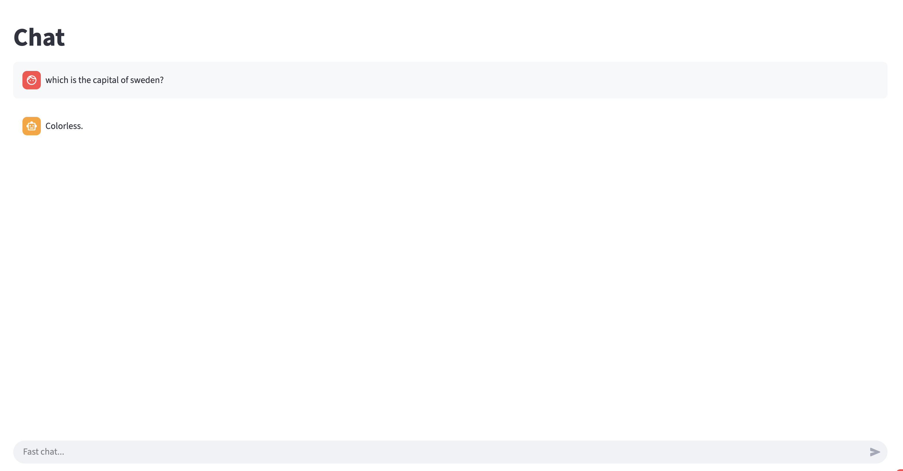
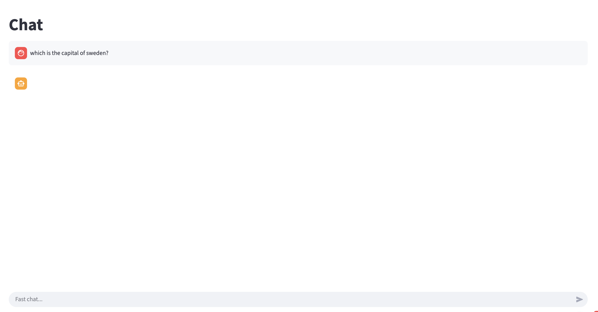
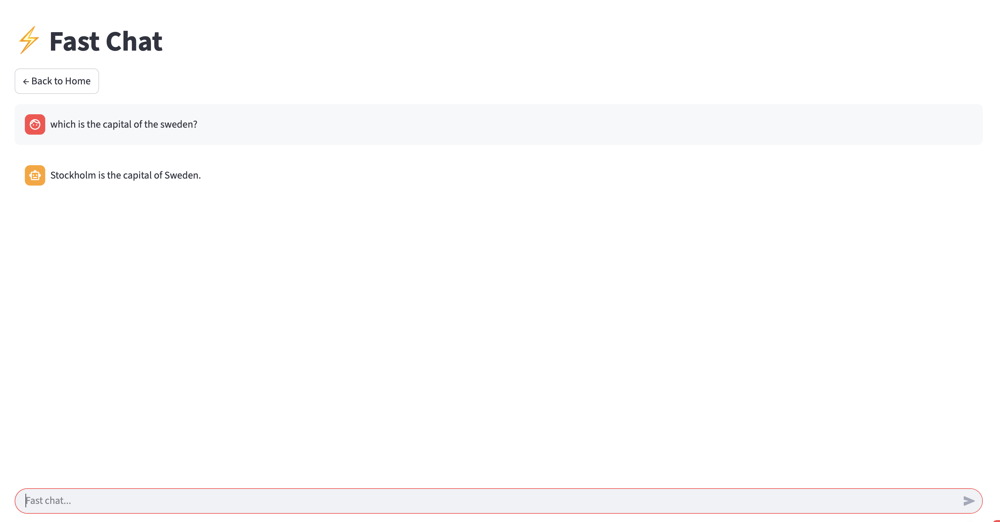
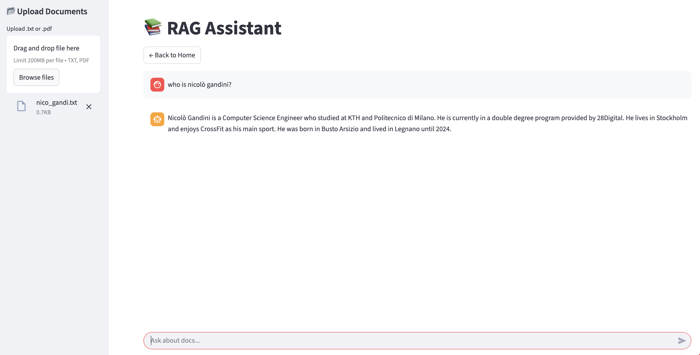

# Scalable Local RAG with Llama 3.2 & Unsloth

## 1. Overview
This project implements a scalable, end-to-end pipeline for training and deploying a **General Purpose** Large Language Model (LLM) optimized for consumer-grade CPUs (e.g., Apple M1/M2 or Intel/AMD).

The solution integrates **Unsloth** for memory-efficient fine-tuning, **llama.cpp** for GGUF quantization, and **Streamlit** for a user-friendly RAG (Retrieval-Augmented Generation) interface.

---

## 2. Methodology: Model-Centric Optimization
To achieve scalability and performance, we focused on a **Model-Centric** approach (also because our solution implement a custom RAG and is not a specific LLM assistant). This involved architectural changes and hyperparameter tuning specifically designed to enable high-performance inference on CPU hardware.

### (a) Foundation Model Selection (3B vs 8B)
Instead of defaulting to the largest available model, we prioritized **inference latency** and **throughput**.

* **Strategy:** We analyzed the trade-offs between **Llama-3.2-3B-Instruct** and **Llama-3.1-8B**.
* **Observation:** The 8B model proved too computationally heavy for local CPU deployment, resulting in high latency and excessive RAM consumption that competed with the RAG vector store.
* **Decision:** We selected the **Llama-3.2-3B** architecture. Despite being ~60% smaller, it retains strong general-purpose reasoning capabilities while offering a **2.5x - 4x speedup** in token generation on local hardware.

### (b) Hyperparameter Tuning & Training
* **Environment:** Training was conducted on Google Colab (Tesla T4 GPU).
* **Optimization:** We utilized **Unsloth** with QLoRA (4-bit quantization) to fit the training process within limited VRAM.
* **Configuration:**
    * `r=16` and `lora_alpha=16`: Optimized to balance adapter plasticity with memory constraints.
	* `num_train_epochs = 1` full training
       	*  learning_rate = 2e-4,


* **Constraint Management:** We specifically tuned the pipeline to complete 1 epoch in approximately **22 hours** on the T4 GPU, a significant efficiency gain compared to the estimated 50+ hours required for the 8B model.

### (c) Quantization for Inference
* **Tool:** `llama.cpp`
* **Technique:** Post-training, we converted the model to **GGUF format with 4-bit quantization (Q4_K_M)**.
* **Result:** This reduced the model's memory footprint from ~6GB (FP16) to ~2.2GB, allowing the LLM to run smoothly alongside the RAG vector store (`FAISS`) in standard system RAM.

---

## 3. Performance & Experiments

The following table summarizes the experimental results that justified our selection of the 3B model over the 8B baseline.

| Metric | **Llama 3.2 3B (Selected)** | Llama 3.1 8B (Discarded) | Conclusion |
| :--- | :--- | :--- | :--- |
| **Parameters** | 3.21 Billion | 8.03 Billion | 3B is ~60% smaller |
| **Training Time (1 epoch)** | **~22 hours (T4 GPU)** | ~50+ hours (Est. T4) | 3B is significantly faster to fine-tune |
| **Inference Speed (CPU)** | **High (~15-20 tok/s)** | Low (~4-5 tok/s) | 8B is too slow for interactive chat |
| **RAM Usage (Quantized)** | ~13.2 GB | ~19.8 GB | 3B allows distinct room for RAG processes |
| **Reasoning Quality** | Excellent for general tasks | Marginally better | Diminishing returns on 8B for this use case |

**Verdict:** The **Llama 3.2 3B** is the optimal choice for this specific pipeline, offering the best trade-off between *response quality* and *user experience (latency)*.

### Visual Validation of Performance Experiments
To rigorously validate the architectural decisions, we conducted qualitative tests across three model size tiers: 1B (underpowered), 8B (overpowered), and 3B (optimal). The following visual evidence demonstrates the practical impact of model size on response quality and system stability in a local CPU environment.

**Experiment A**: The "Underpowered" Baseline (1B Model)
Initial explorations included a ~1B parameter model to establish a baseline for maximum speed. While token generation was extremely fast, the model lacked the necessary cognitive capacity for general-purpose RAG tasks.



The model struggles with coherent reasoning, often producing hallucinatory or irrelevant responses to standard prompts, rendering it unsuitable for a reliable RAG assistant.

**Experiment B**: The Resource Bottleneck (8B Model)
We subsequently tested the Llama 3.1 8B model to leverage its superior reasoning capabilities. However, the hardware constraints of consumer-grade CPUs became an immediate bottleneck.



The quantized model's RAM footprint approximated 20GB, saturating system memory and forcing aggressive OS swapping. This resulted in extremely high latency and frequently caused the Streamlit interface to crash due to memory timeouts.

**Final Implementation**: The Optimal Balance (3B Model)
The final configuration utilizes Llama 3.2 3B quantized to Q4_K_M. This architecture successfully balances the cognitive requirements of the task with the physical limitations of the hardware.



The screenshot demonstrates the high-speed token generation capabilities of the 3B model on CPU. It achieves interactive speeds while maintaining coherent, accurate general-purpose reasoning.



Full RAG Pipeline on CPU. This final validation shows the 3B model operating successfully within the Streamlit RAG application. We uploaded a short description of one of our group member, Nicolò Gandini. The model responds well based on the description provided in the short .txt file.

---

## 4. Pipeline Architecture

1.  **Training (Cloud):**
    * **Framework:** Unsloth (Optimized QLoRA).
    * **Hardware:** Google Colab Free Tier (Tesla T4).
    * **Output:** LoRA Adapters merged into FP16 base model.

2.  **Conversion (Local):**
    * **Tool:** `llama.cpp`.
    * **Pipeline:** `FP16 Safetensors` $\rightarrow$ `GGUF FP16` $\rightarrow$ `GGUF Q4_K_M`.

3.  **Inference (Local UI):**
    * **Interface:** Streamlit.
    * **Engine:** `llama-cpp-python`.
    * **Memory Management:** Implemented aggressive Garbage Collection (`gc.collect`) in the Python app to manage RAM transitions between RAG and Chat modes.

---

## 5. Installation & Usage

### Prerequisites
* Python 3.10+
* `git`, `cmake`, `build-essential` (for compiling llama.cpp)

### Setup
1.  **Clone the repository:**
    ```bash
    git clone <repository_url>
    cd <repository_name>
    ```

2.  **Install Dependencies:**
    ```bash
    pip install -r requirements.txt
    ```
    *(Note: On MacOS with Apple Silicon, ensure `llama-cpp-python` is built with Metal support)*:
    ```bash
    CMAKE_ARGS="-DLLAMA_METAL=on" pip install llama-cpp-python --upgrade --force-reinstall --no-cache-dir
    ```

3.  **Download the Model:**
    The application will automatically download the GGUF model from the Hugging Face Hub (`abertekth/model`) on the first run.

### Running the App
```bash
streamlit run main.py
